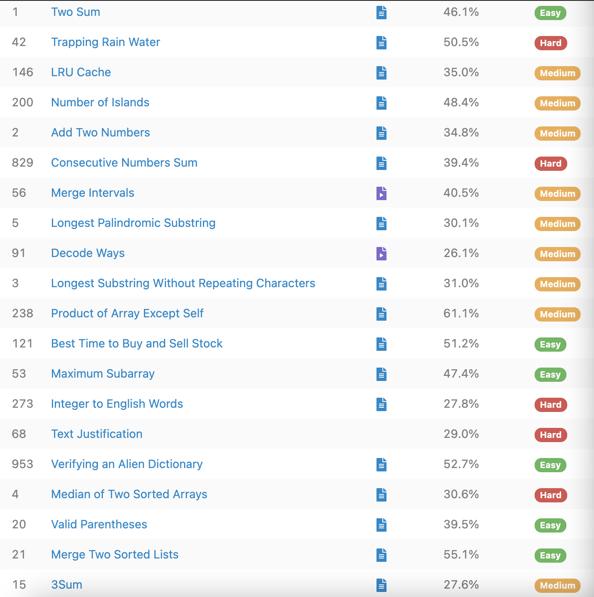
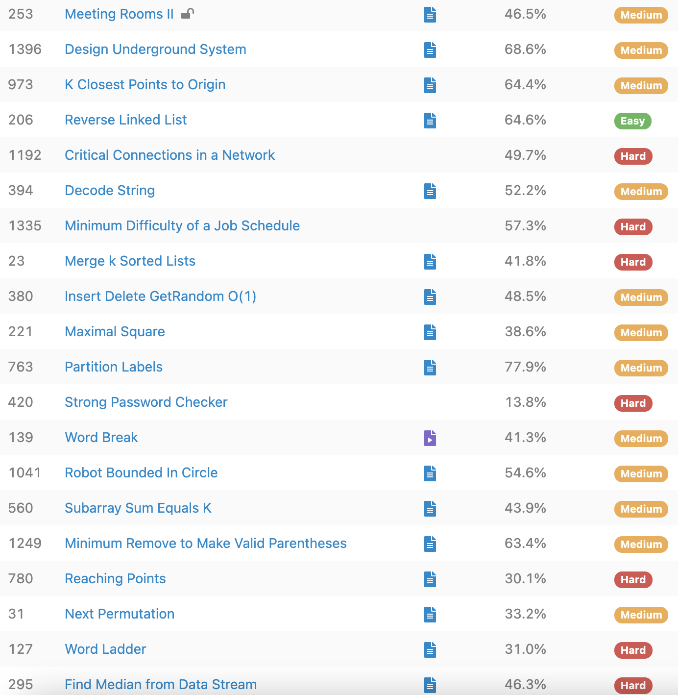
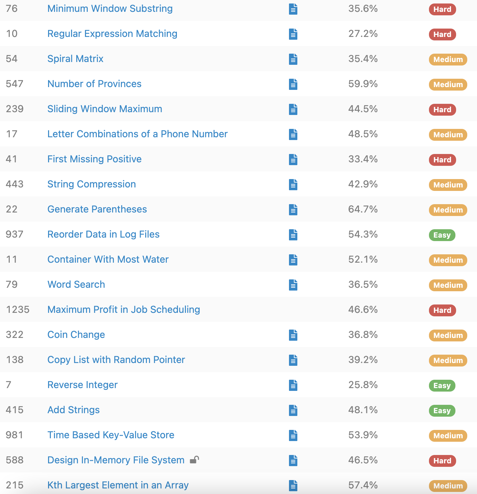
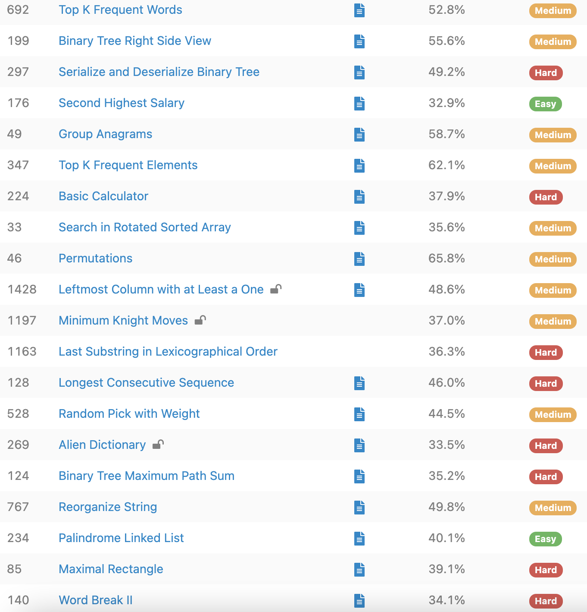
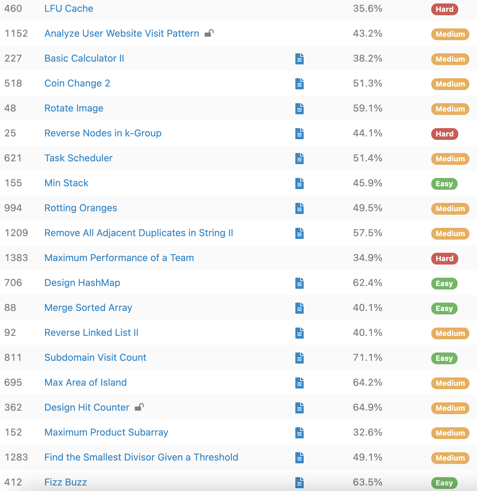

# LeetCode Summary

## Top 20

[1. Two Sum](./questions/1.%20Two%20Sum.md)	Easy - [Link](https://leetcode.com/problems/two-sum/)

[42. ]

[146. ]

[200. ]

[2. Add Two Numbers](./questions/2.%20Add%20Two%20Numbers.md)	Medium - [Link](https://leetcode.com/problems/add-two-numbers/)

[829. ]

[56. ]

[5. ]

[91. Decode Ways](./questions/91.%20Decode%20Ways.md)	Medium - [Link](https://leetcode.com/problems/decode-ways/)

[3. Longest Substring Without Repeating Characters](./questions/3.%20Longest%20Substring%20Without%20Repeating%20Characters)	Medium - [Link](https://leetcode.com/problems/longest-substring-without-repeating-characters/) 

[238. ]

[121. ]

[53. ]

[273. ]

[68. ]

[953. Verifying an Alien Dictionary](./questions/953.%20Verifying%20an%20Alien%20Dictionary.md)	Easy - [Link](https://leetcode.com/problems/verifying-an-alien-dictionary/)

[4. ]

[20. Valid Parentheses](./questions/20.%20Valid%20Parentheses.md)	Easy - [Link](https://leetcode.com/problems/valid-parentheses/)

[21. Merge Two Sorted Lists](./questions/21.%20Merge%20Two%20Sorted%20Lists.md)	Easy - [Link](https://leetcode.com/problems/merge-two-sorted-lists/)

[15. ]

[152. ]

[1283. ]

[412. Fizz Buzz](./questions/412.%20Fizz%20Buzz.md)	Easy - [Link](https://leetcode.com/problems/fizz-buzz/)

c3.ai OA:

- [451. Sort Characters By Frequency](./questions/451.%20Sort%20Characters%20By%20Frequency.md)	Medium - [Link](https://leetcode.com/problems/sort-characters-by-frequency/)

- [1220. Count Vowels Permutation](./questions/1220.%20Count%20Vowels%20Permutation.md)	Hard - [Link](https://leetcode.com/problems/count-vowels-permutation/)
  - [935. Knight Dialer](./questions/935.%20Knight%20Dialer.md)	Medium - [Link](https://leetcode.com/problems/knight-dialer/)

